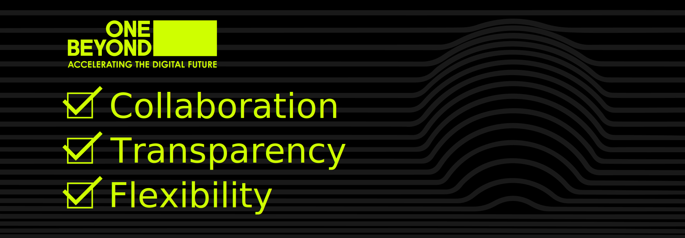

  

 

One Beyond’s commitment to the open source community encourages an attitude of <strong>collaboration, transparency, and flexibility</strong>; a philosophy that enables developers across the world to fulfil their potential and create ground-breaking software, as well as giving back to the open source community the same value that we receive from it. 

Our award-winning team have a vast range of <a href="https://www.one-beyond.com/accreditations/">accreditations</a> and <a href="https://www.one-beyond.com/awards/">awards</a>, displaying a deep understanding of what it takes to create the very best in bespoke software and digital transformation. You can find more information on the <a href="https://www.one-beyond.com/process/technology-stack/">technology stack we operate from here</a>. 

If you think you have what it takes to work within a rapidly growing, multi-national software development business, browse our <a href="https://www.one-beyond.com/careers/">current vacancies here</a>, or <a href="https://www.one-beyond.com/contact-us/">contact us today</a> to find out more about how we can help your business. 

Follow us on

